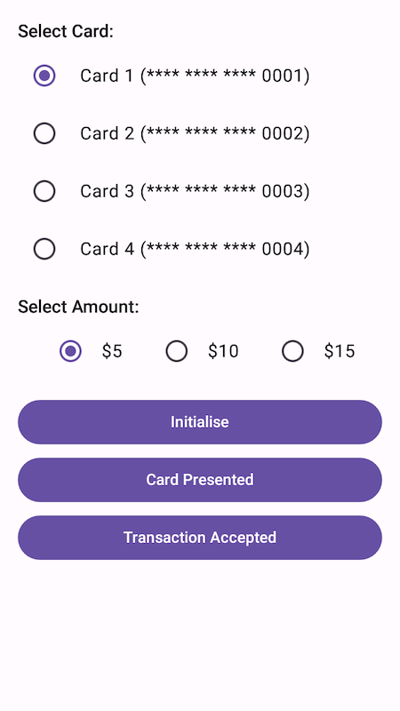

# Venu Terminal Integration Sample

This sample app shows how to integrate your payment application with the Venu terminal SDK.

## Setup

1. Ensure you have the Venu terminal app installed on your device.
2. Clone this repository
3. Open the project in Android Studio
4. Build and run the app on your device

## API Reference

### VenuClient

VenuClient provides the interface between the payment application and the Venu terminal application.

#### connect()
Establishes a connection to the Venu service. Should be called when your activity starts.

#### disconnect()
Disconnects from the Venu service. Should be called when your activity is destroyed.

#### suspend fun initialise(request: VenuInitialiseRequest)
Initialises the Venu service and links the terminal with the Venu backend. This should be called when
the payment application initialises.

In the `metadata` field of the request, provide any information to help identify the terminal—terminal ID, merchant ID, location etc.

#### suspend fun cardPresented(request: VenuCardRequest): VenuCardPresentedResult
Call this method when the payment card has been presented. It will return the discount to apply to the transaction (if any).

#### suspend fun transactionAccepted(request: VenuCardRequest)
Call this method when the transaction has been accepted.
